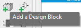

# Project ESBD - Design Blocks
Eagle design blocks that you can drag and drop into your Eagle projects to get you started. Some design blocks will have preliminary layouts that will automatically populate to your board as well. 

We've included an array of common sub-circuit designs such as

 - Linear and switching regulators
 - Battery chargers
 - Audio amplifiers
 - Microcontrollers
 - Motor drivers

 and more, and we have plans to add even more in the future.

## Using these design blocks in Eagle

There are two methods for getting access to these design blocks in Eagle. Both of these methods assume that you already have Eagle installed. You can find directions for getting access to a free educational Eagle license and download [here](https://knowledge.autodesk.com/support/eagle/learn-explore/caas/sfdcarticles/sfdcarticles/Eagle-Education.html).

You will also need to locate the home directory for Eagle on your system. It's typically in `~/Documents/EAGLE`, but you can change this in the Eagle Control Panel under `Options->Directories`. Wherever this folder is, it will have the structure like below:

```
EAGLE
└───archive
└───cam
└───design blocks
└───design rules
└───design blocks
└───projects
└───scripts
└───spice
└───ulps
```

Naturally, we will be putting these design blocks into the `EAGLE/design blocks` directory.

### Method 1: Download and extract `.zip`

This method is easier, but you will have to redownload and replace the design blocks manually every time we push an update if you want to stay up to date. 

1. Click "Releases" on the right hand side of the [home page for this repository](https://github.com/brownby/ESBD-Design-Blocks). 
1. Download the `.zip` for the latest release by clicking the "Source code (zip)" link under "Assets". 
1. Extract the contents into your `EAGLE/design blocks` folder. 
1. The design blocks should now show up in your Eagle Control Panel inside a folder called `ESBD-Design-Blocks-X.X.X` (where `X.X.X` represents the version number). Your directory structure should look like:
```
EAGLE
└───archive
└───cam
└───design blocks
└───design rules
└───design blocks
    └───ESBD-Design-Blocks-X.X.X
└───projects
└───scripts
└───spice
└───ulps
```
5. To use the design blocks in your Eagle projects, simply click the "Add a Design Block" button in the schematic editor. Navigate to the `ESBD-Design-Blocks` directory that you've added and select the design block you would like to use. You then place the block as you would place any other component on the schematic, then place it where you want on the board. You can change the layout of the block as much as you would like if it doesn't fit neatly in your design. 



### Method 2: Clone this repository using `git`

This method requires using [`git`](https://git-scm.com/book/en/v2/Getting-Started-Installing-Git), which is a bit more complicated than downloading a `.zip`, but you'll be able to keep your design blocks up to date by running a single `git pull` command. 

1. Navigate to your `EAGLE/design blocks` directory from within whatever terminal you're runnig `git`
1. Clone the repository
```
git clone git@github.com:brownby/ESBD-design blocks.git
```
3. To use the design blocks in your Eagle projects, simply click the "Add a Design Block" button in the schematic editor. Navigate to the `ESBD-Design-Blocks` directory that you've added and select the design block you would like to use. You then place the block as you would place any other component on the schematic, then place it where you want on the board. You can change the layout of the block as much as you would like if it doesn't fit neatly in your design. 
4. To update the libraries (as this repository is updated), navigate to the `EAGLE/design blocks` directory in your terminal and run:
```
git pull
```
